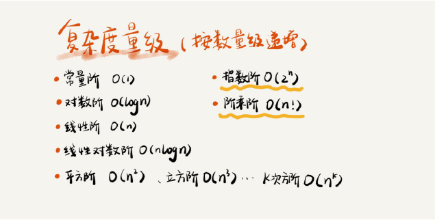
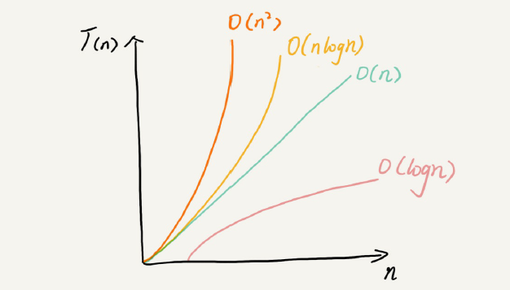

# 数据结构与算法
*数据结构就是数据的存储方式，算法就是数据的操作方式；两者是相辅相成的，不可孤立的；数据结构决定那种算法最优和算法的选择范围[链表是无法用二分查找算法，因为链表不支持随机访问]；*

### 1复杂度分析
*学数据结构和算法首先要学会复杂度分析，复杂度分析是整个数据结构和算法的精髓，掌握了复杂度分析就掌握了数据机构和算法的一半。*
#### 渐进时间复杂度[asymptotic time complexity]分析
*针对计算时间；常用度量级：*

*其又分多项式量级和非多项式量级；其中非多项式量级只有2个：O(2^n ) 和 O(n!)，当数据规模 n 越来越大时，非多项式量级算法的执行时间会急剧增加，求解问题的执行时间会无限增长。所以，非多项式时间复杂度的算法其实是非常低效的算法。因此，关于非多项式时间复杂度一般不深究。*

#### 渐进空间复杂度[asymptotic space complexity]分析
*针对内存使用量；常用的度量级：O(1)、O(n)、O(n^2 )*
#### 度量级对比图

### 2常见的数据结构
#### 线性表
- 数组
- 链表
- 队列
- 栈