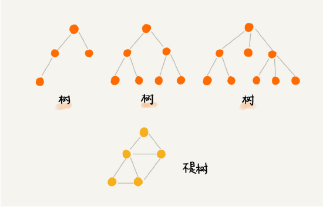
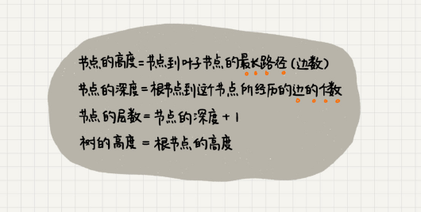
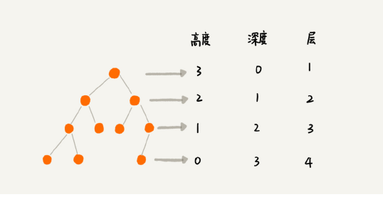
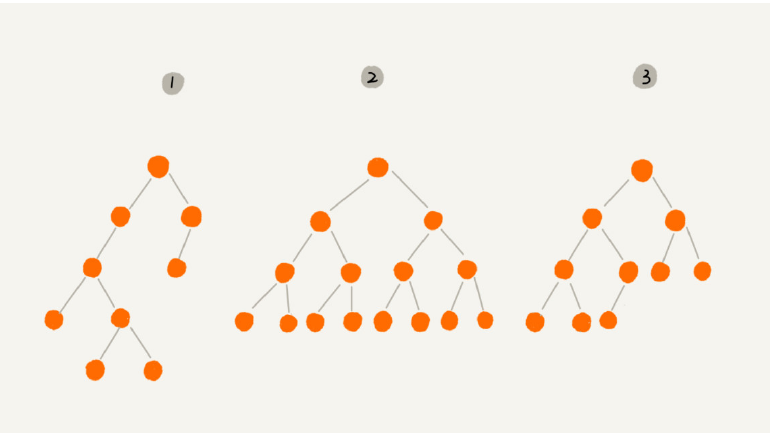
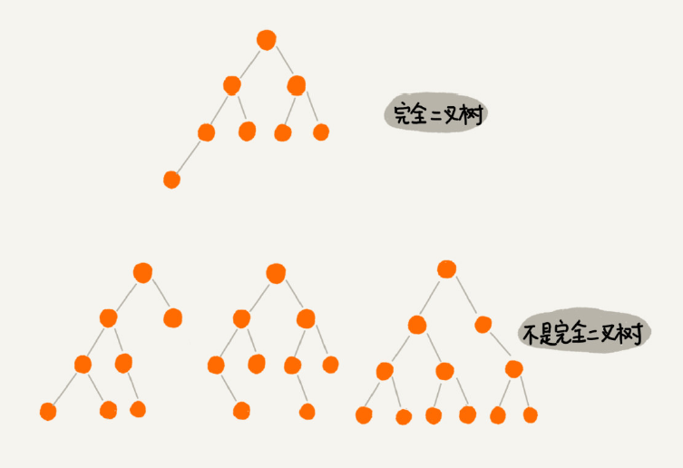
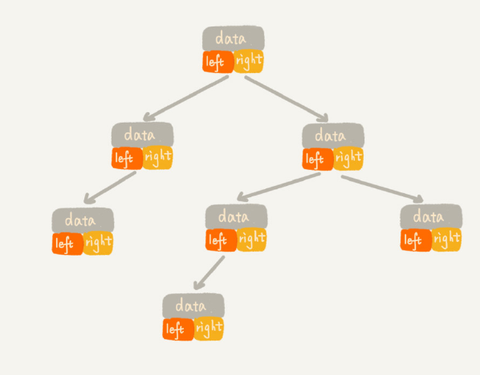
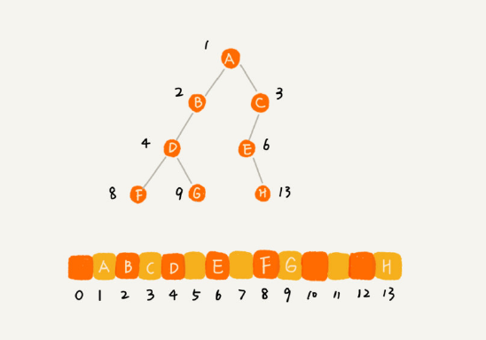

# 树
## 1什么是树？

## 2高度height，深度depth，层level

## 3二叉树[binary tree]
### 3.1分类

*上图中有2个比较特殊的二叉树[满二叉树 完全二叉树]*
- 编号 2 的二叉树中，叶子节点全都在最底层，除了叶子节点之外，每个节点都有左右两 个子节点，这种二叉树就叫作满二叉树；
- 编号 3 的二叉树中，叶子节点都在最底下两层，最后一层的叶子节点都靠左排列，并且除了最 后一层，其他层的节点个数都要达到最大，这种二叉树叫作完全二叉树。*
- 满二叉树也是完全二叉树

#### 3.1.1完全二叉树
*之所以会出现这样的树，主要是跟树的存储方式有关；树的存储方式有链式存储和顺序[数组]存储；如果是完全二叉树又想节约存储空间那就使用顺序存储；*

*完全二叉树与非完全二叉树的区别*
## 3.2存储方式
- 基于指针或引用的链式存储

- 基于数组的顺序存储
*如果某棵二叉树是一棵完全二叉树，那用数组存储无疑是最节省内存的一种方式。因为数
 组的存储方式并不需要像链式存储法那样，要存储额外的左右子节点的指针。这也是为什么完全
 二叉树会单独拎出来的原因，也是为什么完全二叉树要求最后一层的子节点都靠左的原因。*

## 3.3遍历
- 前序遍历
- 中序遍历
- 后序遍历
